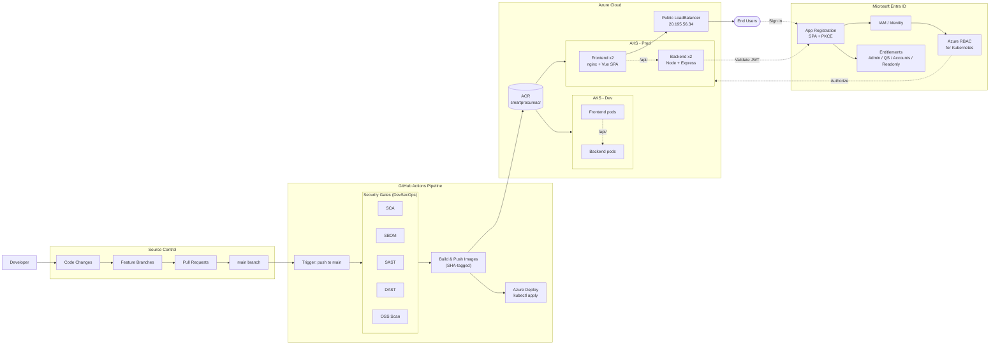

# SmartProcure — AKS Deployment Assessment Summary

## 0. Architecture Diagram

End-to-end target architecture: DevSecOps pipeline feeding Azure Container Registry, deploying to two AKS environments (Dev and Prod), fronted by a public LoadBalancer, with Microsoft Entra ID handling identity and Azure RBAC for Kubernetes handling authorization.



**Components implemented today**: developer → main → GitHub Actions → ACR → AKS Prod → LoadBalancer → Entra ID app registration with role mapping; Azure RBAC for Kubernetes on the cluster.

**Components on the DevSecOps roadmap**: SCA, SBOM, SAST, DAST, and OSS-license scanning as pipeline gates; a dedicated Dev AKS environment; promotion between Dev and Prod; Ingress + TLS for HTTPS on the public endpoint. The pipeline is structured to accept these gates as additional steps without rework.

## 1. Application Overview

- **Name**: SmartProcure — Procurement Management Platform
- **Architecture**: Two-tier SPA + API
  - **Frontend**: Vue 3 (Composition API) + Vite 5, Pinia state, Vue Router 4, MSAL.js for Azure AD auth
  - **Backend**: Node.js 20 + Express 5, JWKS-based Azure AD id-token validation
- **Authentication**: Microsoft Entra ID (Azure AD) via MSAL — SPA + PKCE authorization code flow
- **Authorization**: Role-based access with four roles — `admin`, `qs`, `accounts`, `readonly` — mapped from user email in backend config

## 2. Project Structure

```
SmartProcureCloud/
├── .github/workflows/
│   ├── deploy.yml              # CI/CD to ACR + AKS
│   └── ai-review.yml
├── k8s/manifests.yml           # Namespace, Secret, Deployments, Services
├── frontend/
│   ├── Dockerfile              # node:20-alpine → nginx:1.27-alpine
│   ├── nginx.conf              # SPA fallback + /api reverse proxy
│   ├── vite.config.js
│   └── src/
│       ├── main.js
│       ├── App.vue
│       ├── auth/msal.js        # MSAL singleton
│       ├── config/authConfig.js
│       ├── router/index.js
│       ├── stores/auth.store.js
│       └── views/
│           ├── LoginView.vue
│           ├── AdminDashboard.vue
│           ├── QsDashboard.vue
│           ├── AccountsDashboard.vue
│           └── ReadonlyDashboard.vue
└── backend/
    ├── Dockerfile              # node:20-alpine
    ├── index.js                # Express bootstrap
    ├── config/roles.js         # Email → role mapping
    ├── middleware/auth.middleware.js
    └── routes/auth.routes.js
```

## 3. Containerization

- **Frontend image**: Multi-stage build — `node:20-alpine` builder for `npm ci` + `npm run build`, `nginx:1.27-alpine` runtime serving static `dist/`. Runs as non-root. nginx configured with SPA fallback, `/api/` reverse proxy to backend service, gzip, security headers (`X-Frame-Options`, `X-Content-Type-Options`, `Referrer-Policy`), `/healthz` endpoint, long cache headers for `/assets/`.
- **Backend image**: Single-stage `node:20-alpine` with `npm ci --omit=dev`. Listens on port 4000, exposes `/healthz` and `/api/me`. Runs as UID 1000 (node user), `readOnlyRootFilesystem` at runtime.
- **Both images** pushed to Azure Container Registry tagged with both `:<git-sha>` (immutable for rollouts) and `:latest`.

## 4. Azure Infrastructure

| Resource | Name | Region |
|---|---|---|
| Subscription | `565d6dc9-3dd7-4506-9477-41e889034f5d` | — |
| Resource Group | `smartprocure-rg` | `southeastasia` |
| Container Registry | `smartprocureacr` (`smartprocureacr.azurecr.io`) | `southeastasia` |
| AKS Cluster | `smartprocure-aks` | `southeastasia` |

- **AKS configuration**: AAD-integrated cluster with **Azure RBAC for Kubernetes** enabled
- **Ingress**: None currently — frontend exposed via `Service type: LoadBalancer`
- **External IP**: `20.195.56.34` (frontend LoadBalancer)

## 5. Azure AD / Entra ID Configuration

- **Tenant**: `ravichandrankarthikagmail.onmicrosoft.com`
- **Tenant ID**: `98587403-b531-456c-8d95-84d5d6845a6a`
- **App registration client ID**: `3ea48b59-7c9b-487e-8e90-ade7b7a0caa2`
- **Platform**: Single-page application (SPA) with PKCE
- **Registered redirect URIs**: `http://localhost:5173/` (dev)
- **Exposed scopes**: `openid`, `profile`, `email`, `User.Read`
- **Test accounts** (for assessment):
  - `admin@ravichandrankarthikagmail.onmicrosoft.com` — Admin role
  - `qs@ravichandrankarthikagmail.onmicrosoft.com` — QS role
  - `accounts@ravichandrankarthikagmail.onmicrosoft.com` — Accounts role
  - `readonly@ravichandrankarthikagmail.onmicrosoft.com` — Read-only role

## 6. Kubernetes Manifests

File: `k8s/manifests.yml` — single file with six documents.

- **Namespace**: `smartprocure`
- **Secret** (`azure-ad-config`, type `Opaque`): `AZURE_CLIENT_ID`, `AZURE_TENANT_ID`, `NODE_ENV=production`, `PORT=4000`, `CORS_ORIGINS`
- **Backend Deployment** (`backend`):
  - Replicas: 2, rolling update strategy (maxUnavailable=0, maxSurge=1)
  - Image: `smartprocureacr.azurecr.io/backend:<sha>`
  - Port: 4000
  - Liveness probe: HTTP GET `/healthz`
  - Readiness probe: HTTP GET `/api/health`
  - `securityContext`: `runAsNonRoot: true`, `readOnlyRootFilesystem: true`, `allowPrivilegeEscalation: false`, all capabilities dropped
  - Env vars hydrated from `azure-ad-config` Secret
- **Backend Service** (`backend-service`): `ClusterIP`, port 4000 → targetPort 4000
- **Frontend Deployment** (`frontend`):
  - Replicas: 2, same rolling update + security posture
  - Image: `smartprocureacr.azurecr.io/frontend:<sha>`
  - Port: 80
  - Probes on `/healthz` served by nginx
- **Frontend Service** (`frontend-service`): `LoadBalancer`, port 80 → targetPort 80

## 7. CI/CD Pipeline

File: `.github/workflows/deploy.yml`

- **Trigger**: `push` to `main` + `workflow_dispatch` (manual)
- **Concurrency**: group-scoped to branch, prevents overlapping runs
- **Permissions**: `contents: read`
- **Steps**:
  1. `actions/checkout@v4`
  2. `azure/login@v2` with `auth-type: SERVICE_PRINCIPAL` via `AZURE_CREDENTIALS` secret
  3. `az acr login`
  4. `docker/setup-buildx-action@v3` for BuildKit caching
  5. `docker/build-push-action@v5` × 2 — frontend and backend — with registry-backed build cache (`:buildcache` tag on ACR)
  6. `azure/aks-set-context@v3` to pull kubeconfig
  7. `az aks install-cli` to install `kubelogin` + `kubectl` on the runner
  8. `kubelogin convert-kubeconfig -l azurecli` — converts AAD kubeconfig to reuse the az-cli login
  9. `kubectl apply -f k8s/manifests.yml`
  10. `kubectl set image` on both deployments with SHA-tagged images (immutable rollout)
  11. `kubectl rollout status` on both deployments with a 3-minute timeout
  12. Print `frontend-service` external IP

## 8. Service Principal (for CI/CD)

- **Display name**: `smartprocure-gh-actions`
- **App ID**: `efdebc6e-c913-4cd9-ab26-b6355c536558`
- **Object ID**: `a158653b-5f2b-4b21-9492-e3d230a33ec1`
- **Role assignments**:
  - `Contributor` on `smartprocure-rg`
  - `AcrPush` on `smartprocureacr`
  - `Azure Kubernetes Service RBAC Cluster Admin` on `smartprocure-aks`
- **GitHub Actions secret**: `AZURE_CREDENTIALS` containing the full SDK-auth JSON

## 9. Verified Working

- Local development sign-in flow at `http://localhost:5173/` — MSAL popup flow, role-based redirect to correct dashboard, `/api/me` returns role based on email
- Deployed frontend serves SPA successfully at `http://20.195.56.34/` (HTTP 200, nginx 1.27, real SmartProcure HTML, all security headers present)
- Both frontend and backend pods running 2/2 replicas, healthy endpoints
- CI/CD pipeline green on every push to `main` — builds and pushes both images to ACR, applies manifests, rolls out new image tags, reports external IP

## 10. Known Limitations / Pending

- **Live sign-in from the deployed public IP**: blocked by Entra ID's rule that non-localhost redirect URIs must be HTTPS. Resolution path is to install `ingress-nginx` + `cert-manager` with a Let's Encrypt `ClusterIssuer`, front the service with an Ingress using a `nip.io` (or custom) hostname, and register the HTTPS URL in the Entra ID app. This is documented as the production-shaped next step and scoped for a follow-up iteration.
- No horizontal pod autoscaler yet — replicas fixed at 2 for each deployment
- No centralized observability — relying on `kubectl logs` + Azure Monitor for Containers default metrics
- Secrets currently held as Kubernetes `Opaque` Secrets; production would move these into Azure Key Vault with the CSI driver

## 11. Security Posture

- Non-root containers with `readOnlyRootFilesystem` and dropped Linux capabilities
- AAD-integrated AKS with Azure RBAC for Kubernetes — no cluster admin certificates in circulation
- Service principal scoped to minimum necessary roles (no Owner, no subscription-wide Contributor)
- GitHub push protection enabled at repo level — already caught and blocked one accidental secret commit during development
- nginx sends standard security response headers; backend uses `helmet`, CORS allowlist via env var
- Azure AD id-token signature and audience verified on every authenticated request via `jwks-rsa`
